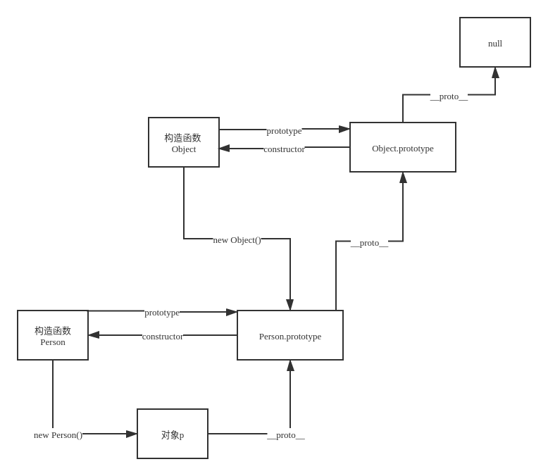

# 2020/06/03 模块二直播

## 函数式编程

### lodash & lodash/fp 模块

fp 模块　迭代优先，数据置后

### 函子在开发中的实际应用场景

将副作用控制在函子外部，将处理函数给用户定义

### 闭包函数

如不释放，会产生内存泄漏。

### 柯里化

延迟执行; 封装不常变的参数;

### lodash

- chain 方法：显式链式调用
- tap 方法: 进入方法链序列以便修改中间结果
- thru 方法: "传递" 值到一个方法链序列以取代中间结果

隐式调用：对于单返回值，直接返回，结束链式调用

## JavaScript 性能优化

略

## 函数执行

- 函数的活动对象
  - 执行上下文
    - 全局执行上下文
    - 函数级执行上下文
    - eval 执行上下文
  - 函数执行的阶段分为：函数建立、函数执行
    - 创建执行活动上下文对象
    - 把变量对象转换为活动对象

## 闭包

闭包的定义：有权访问另一个函数作用域中的变量的函数

1. fn 外部对内部诱因用
2. 在另一个作用域可以访问 fn 的局部成员

## 对象的原型链

## Gulp 能做什么

Gulp: 基于流的自动化构建工具, 使用 gulpfile 　配置文件，设置不同的任务, 不支持模块化

在综合领域更强大, electron, 前后端没有分离的项目

## 防抖、节流

防抖：debounce 　延时执行

节流：throttle 等间隔时间执行
